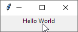
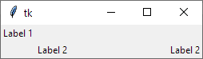
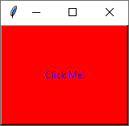
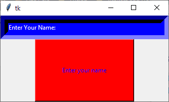

# Creating a simple GUI

In this repo I go through the different functionality of a Python GUI Library that is packaged with Python called 'Tkinter'.


- hello.py: 
This is where I create a simple window with a 'Hello World' label in the window. The 'pack()' method is used to quickly..pack it all in into the window without worrying about specifying where.




- grid.py
This is where I instead of 'packing' it all into the window I try the grid layout to put text into specific rows and columns.





- buttons.py
This is where I try a button for the first time - woohoo!





- entry.py
This is where I make the button actually do something by adding an entry field that asks for my name, when I press the button a label appears below greeting me.



# I'll be adding to this as I try new wonderful things with the GUI.


```python

```
